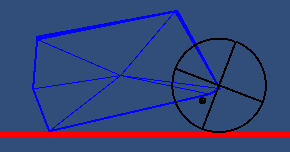
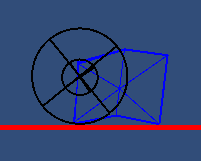
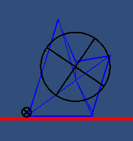

### Genetic Cars

##### Introduction
Inspired by other Genetic Cars simulations and showcases of Genetic Algorithms I am attempting to create my own Genetic Cars sim.

##### Car Design
The cars themselves are designed very simply with a body and two wheels. Each car has a body in the shape of a polygon consisting of six vertices. The points are parsed and organized in such a way as to ensure the shape has no internal intersections.

The wheels are centered on two vertices. Due to randomized gene the wheels could theoretically be placed on the same vertex.

##### Genome Basics
TODO

Note: Genome will transition to a binary representation to help with simplicity

**The Following Are Examples of Generated Cars**

  
  

**Planned**

* Modification of car mass
* Modification of wheel mass
* Modification of wheel suspension ratio
* Modification of wheel suspension oscillation frequency
* Modification of wheel physical material
* Modification of wheel power

##### Other Planned Features

* Implementation of coloring of cars to denote lineage
* Implementation of multiple cars at a time
* Implementation of gene recombination
* Implementation of base mutation
* Implementation of roulette selection for gene recombination
* Implementation of stochastic selection for gene recombination
* Implementation of tournament selection for gene recombination
* Imlementation of reward-based selection for gene recombination
* Implementation of elite **n** cars from each generation

##### Licensing
All code is available for reading but may not be reproduced, copied, or used without explicit permission. For permission please contact Dylan Lawrence -- dlawre14@slu.edu
